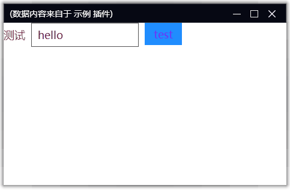

# 数据绑定

通常情况下，插件通过 `getControlValue` 获取控件数据，通过 `updateControlValue` 更新控件数据。

也可以使用数据双向绑定，将控件数据与插件成员变量进行关联。

双向绑定的方法是，在控件创建时，使用 `':value': '变量名'` 的形式初始化，此时该控件个相应的变量会建立对应关系：

* 当 python 变量值发生变化时，会自动更新控件值；
* 当读取 python 变量值时，会从控件上获取控件最新值；

```python
class myplugin(StellarPlayer.IStellarPlayerPlugin):
    def __init__(self,player:StellarPlayer.IStellarPlayer):
        super().__init__(player)
        self.a = 'hello'

    def show(self):
        controls = [
            [
                {
                    'type':'edit',
                    'name':'测试',
                    'height': 40, 
                    'textColor': '#772244', 
                    'fontSize': 18,
                    ':value': 'a'
                },
                {
                    'type':'button',
                    'name':'test',
                    'height': 40, 
                    'textColor': '#7722ff', 
                    'fontSize': 18,
                    'value': 'hello',
                    '@click': 'on_hello'
                }
            ],
            {'type':'space'}
        ]
        self.doModal('main',600, 500,'测试', controls)

    def on_hello(self, *a):
        self.a = self.a + '~'
```




如果是 list 类型的数据绑定到控件上，当 list 值发生变化后，需要显式赋值触发控件 value 的刷新

```python
self.data.append(1)
self.data = self.data
```

> 由于 list 和 grid 是内容展示类型的控件，所以只支持从 python 变量到控件值的绑定。