# 控件

## 通用属性

各控件包含以下通用属性：

### width

控件宽度，计算规则参见 [布局](/layout)

### height

空间高度，计算规则参见 [布局](/layout)

- 为最外围行属性时，表示该行的最大高度
- 为子元素属性时，表示该子元素高度，但不会超过所在行的高度

### value

控件值，比如文本框内容等

- 可选属性
- 可以为 `list` 控件设置字符串数组值

### textColor

控件文字颜色

- 可选属性
- 设置文本颜色，字符串，比如 #ff0000 表示红色

### fontSize

控件文字大小

- 可选属性
- 设置文本字体大小，单位为像素，整数值

---

下面分别介绍各种控件。

## 文本框 - label

显示一行或多行文字，可通过 \n 换行
如果指定了 value 属性，则文本内容为 value 属性， 否则文本内容为 name 属性

```python
{
    'type':'label',
    'name':'Hello\nStellarPlayer!',
    'height': 60, 
    'textColor': '#ff00ff', 
    'fontSize': 30
}
```

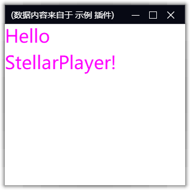

## 复选框 - check

显示一个复选框供用户交互, name 属性为其文本，value 属性为其勾选状态
要动态获取它的勾选状态，请参考 [API](api.html#getcontrolvalue) 或者 [数据绑定](binding.html)

```python
{
    'type':'check',
    'name':'好的',
    'height': 60, 
    'textColor': '#0088ff', 
    'fontSize': 20,
    'value': 1
}
```

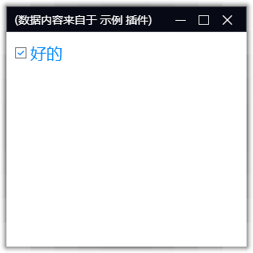

## 单选框 - radio

显示一组单选框供用户交互。
一组 radio 必须放到同个 group 下.
要动态获取它的勾选状态，请参考 [API](api.html#getcontrolvalue) 或者 [数据绑定](binding.html)

```python
controls = {
    'group' : [
        {
            'type':'radio',
            'name':'radio_1',
            'height': 60, 
            'textColor': '#aa55ff', 
            'fontSize': 20,
            'value': 1
        },
        {
            'type':'radio',
            'name':'radio_2',
            'height': 60, 
            'textColor': '#aa55ff', 
            'fontSize': 20,
            'value': 1
        },
        {'type':'space'}
    ]
}
```

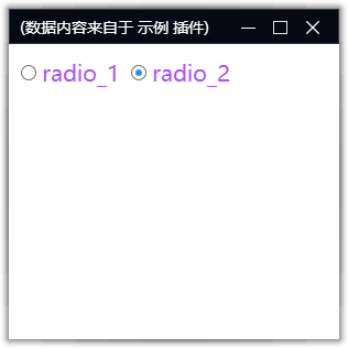

## 按钮 - button

显示一个按钮供用户交互，要响应按钮点击事件，请参考 [事件](event.html)

`name` 属性为按钮显示的文字，注意按钮默认会自适应其文字大小，如果要指定按钮大小，需要将 `matchParent` 属性设置为 `True`

```python
controls = [
    {
        'type':'button',
        'name':'btn',
        'height': 40, 
        'width': 200, 
        'textColor': '#ffffff', 
        'fontSize': 20,
        'value': 1,
        'matchParent': True
    },
    {'type':'space'}
]
```

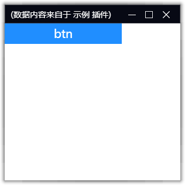

## 超级链接 - link

显示一个超级链接。
用户可以点击该链接打开浏览器转到相应页面
其中 `name` 属性为超级链接的文字，`value` 属性为需要跳转的链接地址

```python
controls = [
    {
        'type':'link',
        'name':'this is a link',
        'height': 40, 
        'textColor': '#004499', 
        'fontSize': 18,
        'value': 'http://bing.com'
    },
    {'type':'space'}
]
```

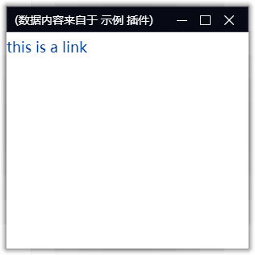

## 文本输入框 - edit

显示一个文本输入框，用于接收用户输入。
要获取用户输入的内容，请参考 [事件](event.html) 和 [数据绑定](binding.html)

```python
controls = [
    {
        'type':'edit',
        'name':'pls enter your name',
        'height': 40, 
        'textColor': '#772244', 
        'fontSize': 18,
        'value': 'jack'
    },
    {'type':'space'}
]
```

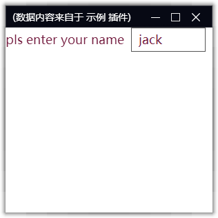

## 图片 - image

显示一个图片，支持网络图片或者本地图片。

```python
controls = [
    {
        'type':'image',
        'name':'img',
        'height': 200, 
        'width': 200, 
        'value': 'https://static.coldlake1.com/staticsource/website-master/assets/app-logo.5379c2ba.png'
    },
    {'type':'space'}
]
```

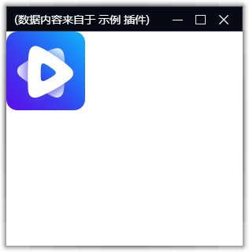

图片也支持 base64 png 格式的 data Url

```python
controls = [
    {
        'type':'image',
        'name':'img',
        'height': 200, 
        'width': 200, 
        'value': 'data:image/png;base64,iVBORw0KGgoAAAANSUhEUgAAACgAAAAhBAMAAABZ3/SWAAAAMFBMVEUDAwOUlJTf3989PT23t7dtbW309PQXFxfHx8dTU1OoqKiBgYH8/Pzr6+vU1NMpKSndUWp9AAAACXBIWXMAAA7EAAAOxAGVKw4bAAAB8klEQVQoz22SQUgUYRTH/yCyiIdllaJWC5xiGGEVcRHyUihLybKEUh5qK2ixYY1PWCHprEyybLnNElTQSRAKy0PQwUMXBxnCnh0SBtEpMAqq3bp56uJ7X6166Dt883+/+d6bN//3gf6zQHR6wRRl22of+rd78Cf0rflYbGGG8YQiBfs5gMux1xe7PloDx1T1UcVU8HoYTs3oVP9nnKMzhDVmuF6v9o2DphAr/Gio1eH6MIcZvIckSKx8rnGKw7cCI6+k3kBt7GRAawXgGlYLaOQT9vQzs3TkBvmuQN57ifLpl9ncYjFmEnfYDnqIdqKtK8lKLh13lmgD0Rpo7Bx/u7M/OWLuHO+bpRVMKpDqCImsUjwddKfmH5DXd14M+ao7zA3ZwedAkd8iLsnOKz9I2ix6IdA7qn/bMehTKKokcDUj0rKyxbnfonYE3kzIwSH7XrYlL7JDMayKa+spo8tQ3izL7ZDg9UuOd3+0kipbcyxvZQg/mrVF28tO0XnzhbPGewnDjbqRd6Mj8fSyIbBZwW1I6JZak8ld02A1HsnA1W5yT8Hmkiftb+AxXJzVcLP8PSHW0wXcYdik83PFX/qlx4Ahnh6+Mp08HoHREwfsg/sPYmp/xPlW1CF2B/9OffoJDiCiV8vOYtulAg5D4G4B9RXZAwWBUakn6fPhAAAAAElFTkSuQmCC'
    },
    {'type':'space'}
]
```

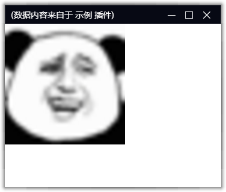

# 列表 - list

显示一个列表控件，用于展示多条数据。
定义一个列表，需要提供列表字段和数据：
* itemlayout：列表中各项的布局（列），可以是嵌套的复杂布局
* value：列表中所有记录的 list，list 中每一项表示列表中的一条记录， 每条记录根据 itemlayout 中的定义进行显示，记录的属性值与 itemlayout 中各个控件的 name 一一对应。
* itemheight：列表中每个元素的高度，默认 30
* marginSize： 列表中各个元素间距
* separator：列表各个元素间是否显示分隔线

```python
itemlayout = [
    [
        {
            'type':'image',
            'name':'image',
            'height': 30, 
            'width': 30
        },
        {
            'type': 'space',
            'width': 8
        },
        {
            'type':'label',
            'name':'desp',
            'textColor': '#000000', 
            'fontSize': 15,
            'width': 100
        }
    ]
]
value = [
    {
        'image': 'https://static.coldlake1.com/staticsource/website-master/assets/app-logo.5379c2ba.png',
        'desp': 'item1'
    },
    {
        'image': 'https://static.coldlake1.com/staticsource/website-master/assets/app-logo.5379c2ba.png',
        'desp': 'item2'
    }
]
controls = [
    {
        'type':'list',
        'name':'list',
        'itemheight': 30, 
        'itemlayout': itemlayout,
        'height': 200,
        'value': value,             
    },
    {'type':'space'}
]
```

上面代码定义了一个列表，列表有两列，由 `itemlayout` 定义，包含 image 和 desp，两列间有留白 space
列表有两个元素，由 `value` 定义，每个元素定义了各自的 image 和 desp

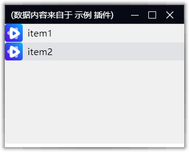

## 网格 - grid

网格与 list 类似，用于展示多条数据。
区别是网格会横向布局，自动换行。

* itemlayout：网格中各项的布局（列），可以是嵌套的复杂布局
* value：网格中所有记录的 list，list 中每一项表示网格中的一条记录， 每条记录根据 itemlayout 中的定义进行显示，记录的属性值与 itemlayout 中各个控件的 name 一一对应。
* itemheight：网格中每个元素的高度，默认 30
* itemwidth ：网格中每个元素的宽度，默认 30
* marginSize： 列表中各个元素间距
* separator：列表各个元素间是否显示分隔线

```python
itemlayout = [
    [
        {
            'type':'image',
            'name':'image',
            'height': 30, 
            'width': 30
        },
        {
            'type': 'space',
            'width': 8
        },
        {
            'type':'label',
            'name':'desp',
            'textColor': '#000000', 
            'fontSize': 15,
            'width': 100
        }
    ]
]
value = [
    {
        'image': 'https://static.coldlake1.com/staticsource/website-master/assets/app-logo.5379c2ba.png',
        'desp': f'item-{i}'
    } for i in range(100)
]
controls = [
    {
        'type':'grid',
        'name':'grid',
        'itemheight': 30, 
        'itemwidth': 300, 
        'itemlayout': itemlayout,
        'height': 80,
        'value': value,             
    },
    {'type':'space'}
]
```

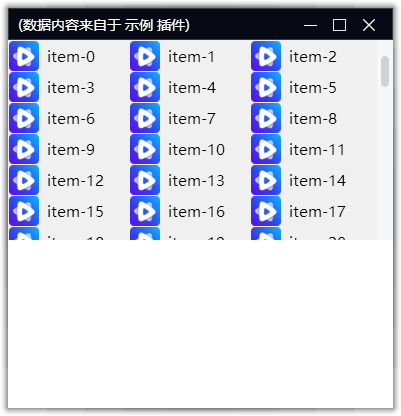

## 空格 - space

用于留白，只影响后面控件的位置，不会生成实际的控件

```python
controls = [[
    {'type':'edit','name':'用户名', 'width': 0.5},
    {'type':'space'},
    {'type':'edit','name':'密码', 'width': 200}
]]
```

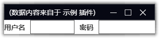

## 控件组 - group

描述控件集合，用于将一组控件作为一个整体进行布局。
其子元素的高宽基于 group 的高宽来计算。

* dir 排列方向：可选值为 horizontal（水平排列，默认值）、vertical（垂直排列）

```python
controls = [
    {
        'group': [
            {'type':'label','name':'text1', 'width': 0.5},
            {'type':'space'},
            {'type':'label','name':'text2', 'width': 200}
        ],
        'height': 40
    },
    {'type':'label','name':'text3', 'height': 40},
    {'type':'space'},
]
```

group 组织了一行水平排列的控件组，然后再和其他控件垂直排列布局。

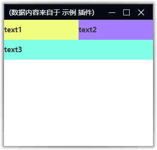


## 浏览器控件 - webview

* value ：浏览器控件 默认打开的网页地址

```python
controls = [    
    {'type':'label','name':'text', 'height': 40},
    {'type':'webview','value':'https://www.stellarplayer.com/blog/'}
]
```

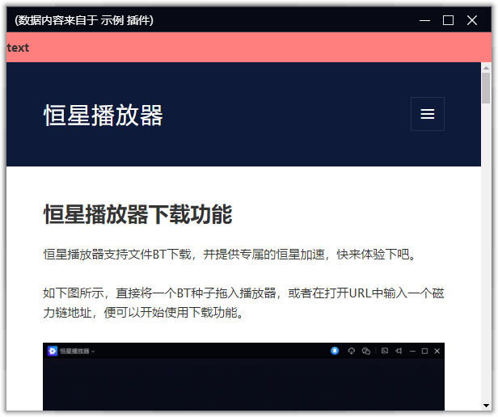