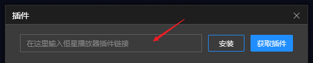
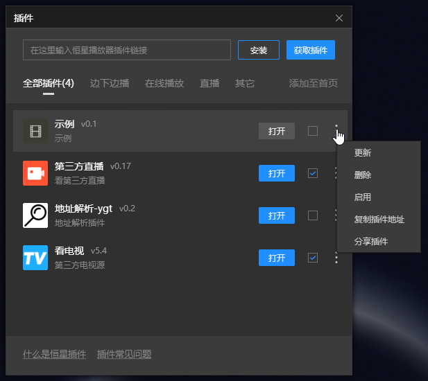
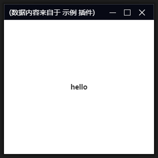

# 快速上手

播放器插件系统基于 Python 设计,Python 版本为 3.8.10。

下面我们从头创建一个最简的恒星播放器插件，你也可以直接 clone 这个项目。

```
https://github.com/stellarplayer/stellar-plugin-test
```

## 项目结构

一个最简的恒星播放器插件，至少包含以下文件:

* icon.png 插件图标文件，PNG 格式，建议尺寸 74 x 74
* main.py 插件代码
* plugin.prop 插件信息文件，类似 ini 格式，需要包含以下信息
    - name=名称
    - description=简要说明
    - version=版本
    - url=项目地址
    - type=插件类型

main.py 是插件的入口文件，需要实现 `newPlugin` 和 `destroyPlugin` 方法。

``` python
import StellarPlayer

class myplugin(StellarPlayer.IStellarPlayerPlugin):
    def __init__(self,player:StellarPlayer.IStellarPlayer):
        StellarPlayer.IStellarPlayerPlugin.__init__(self，player)             
        
    def stop(self):
        return super().stop()

    def start(self):      
        return super().start()
        
    def show(self):
        self.doModal('main',300, 300,'测试', [
			{'type':'label','name':'hello', 'hAlign': 'center'}
        ])

    
def newPlugin(player:StellarPlayer.IStellarPlayer,*arg):
    plugin = myplugin(player)
    return plugin

def destroyPlugin(plugin:StellarPlayer.IStellarPlayerPlugin):
    plugin.stop()
```

其中 `newPlugin` 需要返回一个 `StellarPlayer.IStellarPlayerPlugin` 类型的对象。

plugin.prop 中保存了插件的相关信息。

```ini
name=示例
description=示例秒数
version=0.1
url=https://github.com/stellarplayer/stellar-plugin-test
type=其它
```

其中 url 可以换成你提交到 github 上以后相应的项目地址。

## 安装插件

如果你已经将该项目提交到了 github，那么可以直接打开播放器的插件管理窗口，粘贴项目地址进行安装（要注意是项目的主页地址，不是 git clone 地址）。



如果项目没有提交到 github，你可以将它手动安装到播放器中，方法是将项目文件夹复制到 `%appdata%/StellarPlayer/pyplugin` 文件夹中，如果 pyplugin 文件夹不存在则需创建。

通过插件管理器安装的插件也会安装到此路径下 `%appdata%/StellarPlayer/pyplugin`

## 运行插件

插件安装成功后，我们可以对插件进行管理。

打开插件管理窗口，这时会列出当前已安装的各种插件：



如果插件未启用，可以通过控制菜单启用它。有时会提示启用失败，这说明插件代码或者系统环境出现了问题，需要进行检查。

当插件启用成功后，插件管理窗口中的 “打开” 按钮会处于高亮状态，在这里点击 “打开”， 或者在主窗口通过快捷菜单，都能打开相应插件。

对于我们刚才写的测试插件，打开动作对应的就是以下方法

``` python 
def show(self):
    self.doModal('main',300, 300,'测试', [
        {'type':'label','name':'hello', 'hAlign': 'center'}
    ])
```

这里弹出了一个插件窗口



## 插件的运行

@startuml
start
:播放器启动;
if (初始化 Python 环境) then (no)
    :失败;
    stop
else (yes)
    if (加载插件 main.py) then (no)
        :失败;
        stop
    else (yes)
        if (启动插件 plugin.start) then (no)
            :失败;
            stop
        endif
    endif
endif
#cccccc:用户打开插件;
:显示插件 plugin.show;
#cccccc:用户关闭插件;
:播放器退出;
stop
@enduml

对于没有界面的插件，可以不实现插件的 `show` 方法。相应的，它将不会出现在插件菜单中。

## 内置包

播放器自带的 Python 运行环境中，目前附带有以下第三方包：

* requests
* beautifulsoup 4

## 调试

插件中可以 print 用以调试程序运行状态，print 的内容会保存到日志文件中，位于 `%appdata%\logs` 文件夹下的 `plugin` 开头的日志文件中