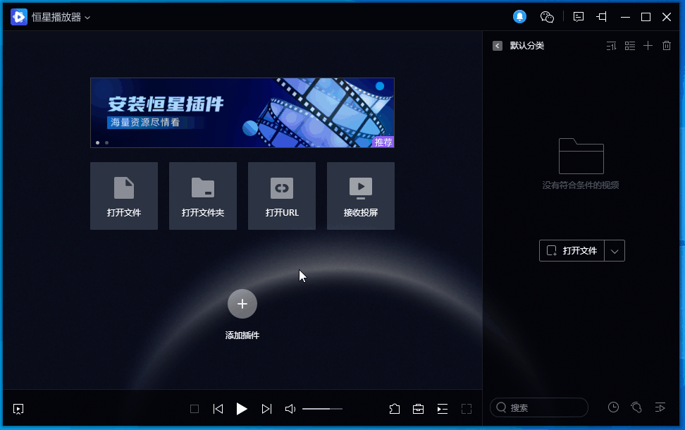

# 插件简介

## 什么是恒星播放器插件

恒星插件是基于恒星播放器提供的开放接口开发的各式各样的小程序。

这些小程序的运行依赖恒星播放器，用户可以安装这种小程序实现诸如多媒体文件管理，视频处理等等各种功能。

## 在哪里能找到各种插件

尝试在百度，贴吧，博客，知乎等地方搜索 `恒星播放器 插件`，有些酷酷的小伙伴可能会在这些地方分享自己开发的插件链接，将链接粘贴在恒星播放器插件管理页面中安装，即可体验这些各式各样的插件。

恒星播放器公开了插件开发的接口和教程，对开发感兴趣的小伙伴都可以开发自己的专属插件，然后上传 `python` 代码文件到 `github` 上，最后在各类社区或自媒体分享你的插件github地址链接，就可以让大家体验你的作品了。

## 如何安装插件

* 先复制恒星播放器插件地址链接, 一般是类似 `https://github.com/stellarplayer/stellar-watch-tv` 这种形式
* 点击播放器主窗口下方按钮, 打开 `插件管理` 对话框
* 在 `插件管理` 对话框上方文本框中， 粘贴插件地址链接，然后点击 `安装`
* 在弹出的插件信息装口中确定安装

## 安装插件常见问题

...