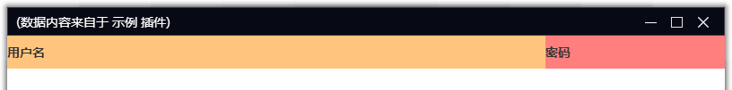

# 布局

恒星播放器插件窗口采用 `doModal` 或 `createTab` 创建，窗口中的控件由函数参数 controls 定义，多个控件通过列表或者 group 的形式组合得到最终界面。

## 控件类型

控件包含以下类型：
* edit : 文本输入框
* check : 复选框
* radio : 单选框
* button : 按钮
* link : 超链接
* label : 文本
* image ：图片
* list : 列表
* grid : 表格 
* webview : 浏览器控件
* space : 空格器（只影响后面控件的位置，不会生成实际的控件）
* group : 控件集合，用于将一组控件作为一个整体进行布局

控件对象通过字典定义，其中 type 表示控件类型，比如：

``` python
{
    "type": "edit",
    "name": "用户名"
}
```

定义了一个文本框。

## 控件布局

多个控件以数组或 group 的形式组合成复杂界面，比如：

``` python
controls = [
    {"type": "edit", "name": "用户名"},
    {"type": "edit", "name": "密码"}
]
```

以上代码定义了一个上下两行的文本输入框


```python
controls = [
    [
        {"type": "edit", "name": "用户名"},	
        {"type": "edit", "name": "密码"}
    ]
]
```

以上代码定义了一行中左右排列的两个文本输入框


```python
controls = [
    [
        {"type":"edit","name":"用户名"},
        {"type":"edit","name":"密码"}
    ],
    {"type":"edit","name":"验证码"}
]
```

以上代码定义了两行布局


## 控件大小

控件大小由控件的 `width` 和 `height` 属性决定，可以取以下值：
* None ： 不改变宽度大小 Auto
* 小于 0 ： 自动计算剩余宽度 Auto
* 小于等于 1.0 的浮点数 ：整体宽度权重 Relative
* 大于等于 1 的整数 ：固定宽度（像素）Fixed

以下是几个例子：

### 平分

```python
def show(self):
    controls = [
        {
            'group': [
                {'type':'label','name':'用户名', 'width': -1},
                {'type':'label','name':'密码', 'width': None}
            ],
            'height': 40                  
        },
        {'type':'space'},
    ]

    self.doModal('main',800, 600,'测试', controls)
```

以上代码中，两个文本控件平分行宽


### 填充

```python
def show(self):
    controls = [
        {
            'group': [
                {'type':'label','name':'用户名', 'width': None},
                {'type':'label','name':'密码', 'width': 200}
            ],
            'height': 40                  
        },
        {'type':'space'},
    ]

    self.doModal('main',800, 600,'测试', controls)
```

以上代码中，“用户名” 填充剩余空间，“密码” 占用 200 像素



### 定宽

```python
def show(self):
    controls = [
        {
            'group': [
                {'type':'label','name':'用户名', 'width': 200},
                {'type':'label','name':'密码', 'width': 200}
            ],
            'height': 40                  
        },
        {'type':'space'},
    ]

    self.doModal('main',800, 600,'测试', controls)
```

以上代码中，两个控件各占用 200 像素


### 权重和定宽

```python
def show(self):
    controls = [
        {
            'group': [
                {'type':'label','name':'用户名', 'width': 0.5},
                {'type':'label','name':'密码', 'width': 200}
            ],
            'height': 40                  
        },
        {'type':'space'},
    ]

    self.doModal('main',800, 600,'测试', controls)
```

以上代码中，“用户名” 占用 50% 宽度，剩余空间中 “密码” 占用 200 像素


### 空白填充

```python
def show(self):
    controls = [
        {
            'group': [
                {'type':'label','name':'用户名', 'width': 0.5},
                {'type':'space'},
                {'type':'label','name':'密码', 'width': 200}
            ],
            'height': 40
        },
        {'type':'space'},
    ]

    self.doModal('main',800, 600,'测试', controls)
```


以上代码中，“用户名” 占用 50% 宽度，剩余空间中 “密码” 占用 200 像素
在两个控件之间有个 “space” 填充了剩余的空间


### 高度

```python
def show(self):
    controls = [
        {'type':'label','name':'用户名', 'height': 0.5},
        {'type':'space'},
        {'type':'label','name':'密码', 'height': 200}
    ]

    self.doModal('main',800, 600,'测试', controls)
```

控件的高度遵循同样的规则， 以上代码中的，“用户名” 占用 50% 高度，
剩余空间中 “密码” 占用 200 像素，
在两个控件之间有个 “space” 填充了剩余的高度空间

